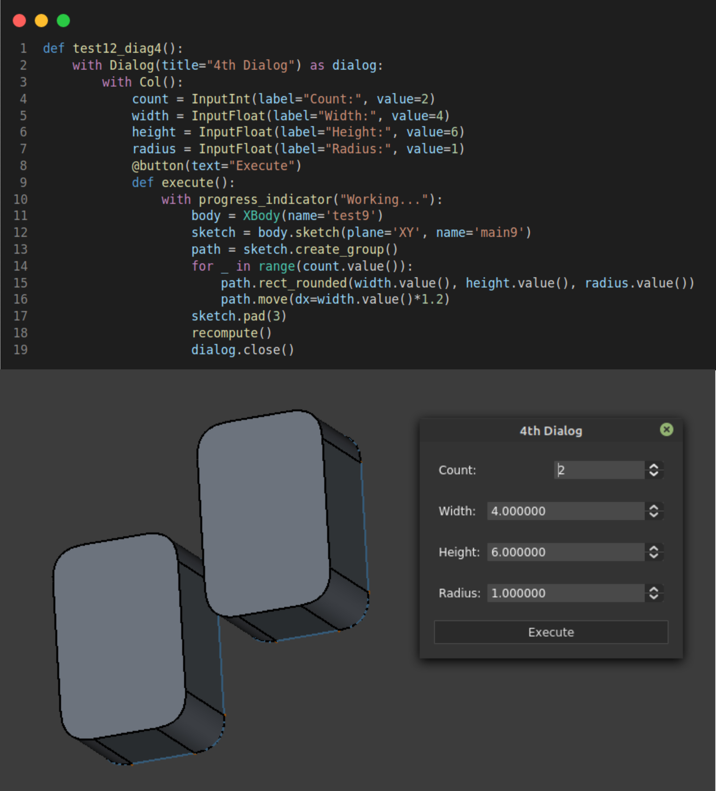

# FCScript

Simple DSL for Macro writers. In other words, a simplified API for macro coders.

Work In Progress ....

## Usage

This AddOn is for people interested in writing macros for FreeCAD. The intention is 
to provide a simplified API for common operations.

## Progress/TODO:

- [75%] Sketcher basic API
- [75%] Basic GUI API
- [5%] Dynamic/Expressions API
- [0%] Draft basic API
- [0%] PartDesign API
- [0%] Part API

## Install

- Use FreeCAD Builtin Addon Manager to install this package.
- Or Download this repo as a zip file and unzip it in `$HOME/.FreeCAD/Mod`, then restart FreeCAD.

## Documentation

Once installed and restarted, you can find a demo Macro called: `FCScript_Demo.FCMacro`. This contains examples.

See: https://github.com/mnesarco/fcscript/blob/main/freecad/fcscript/demo/v_0_0_1.py

Many of the demos require **LinkStage3** because mainstream FreeCAD does not support multiple solids inside a body.

## License

GPL 3.0

